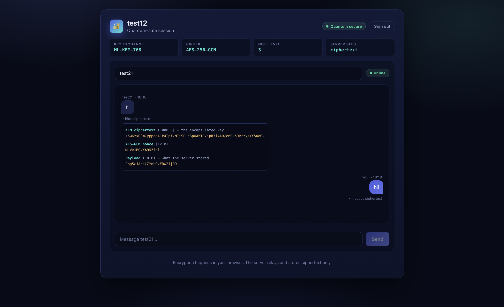
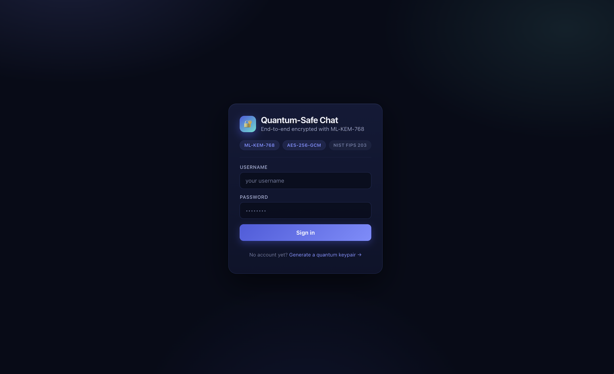
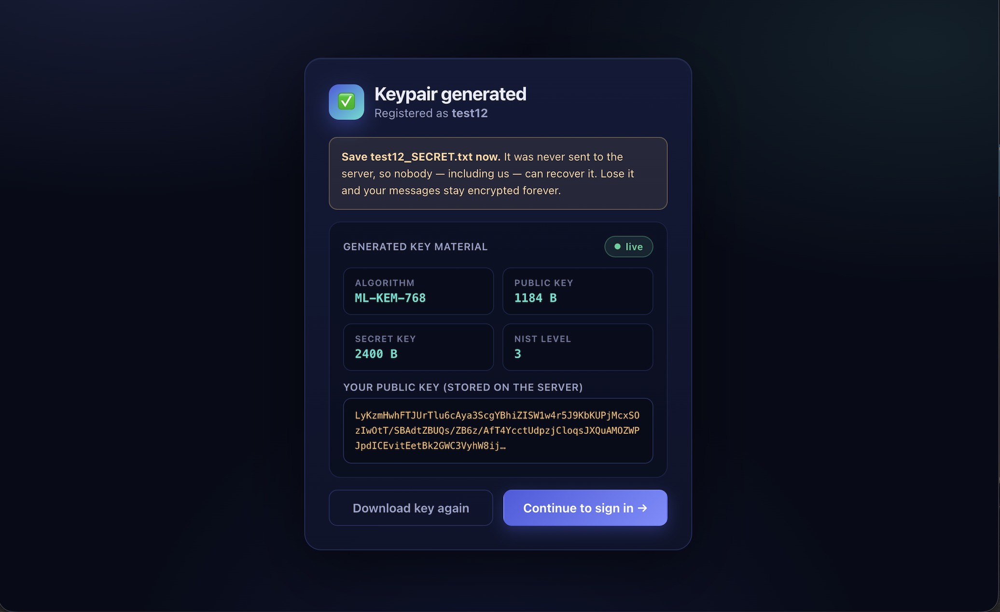
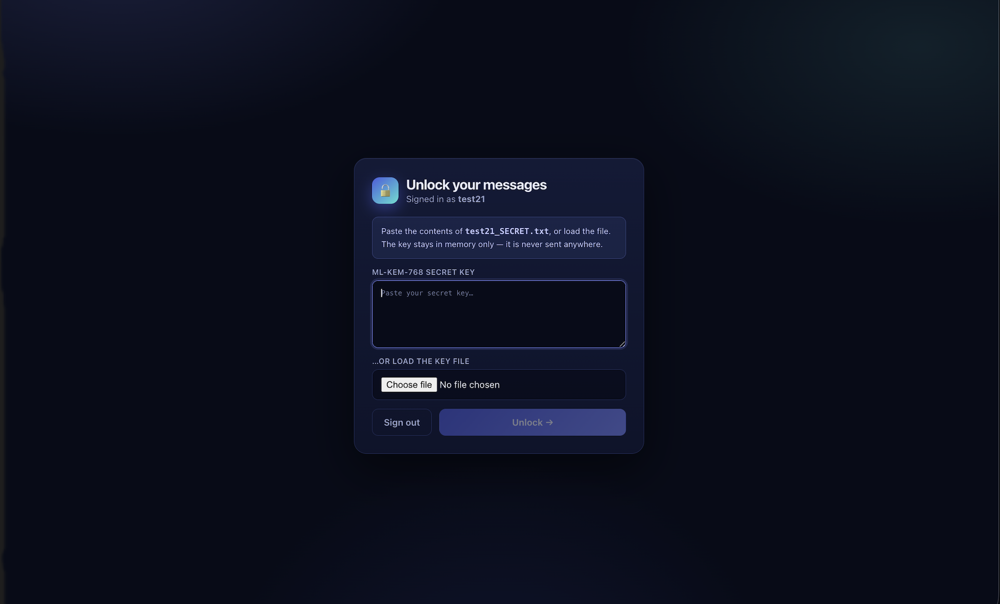
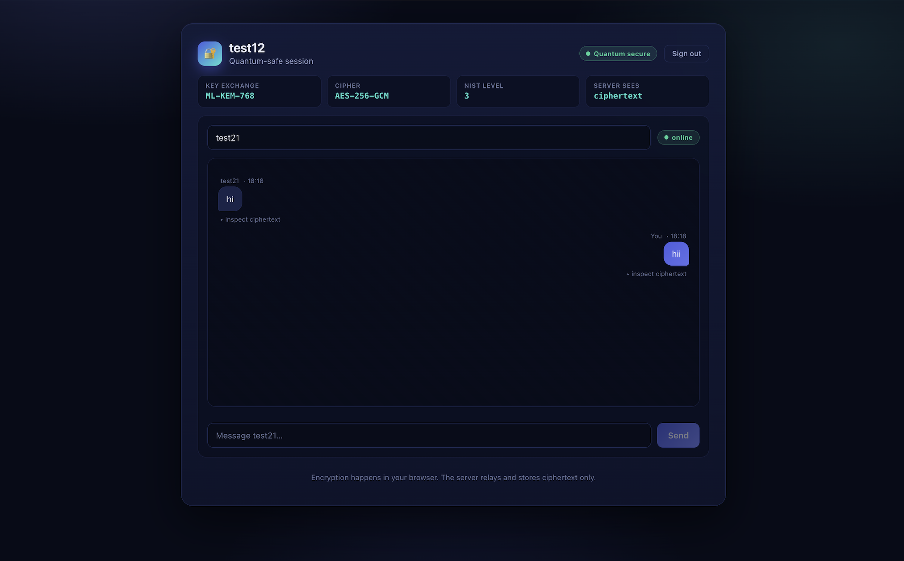
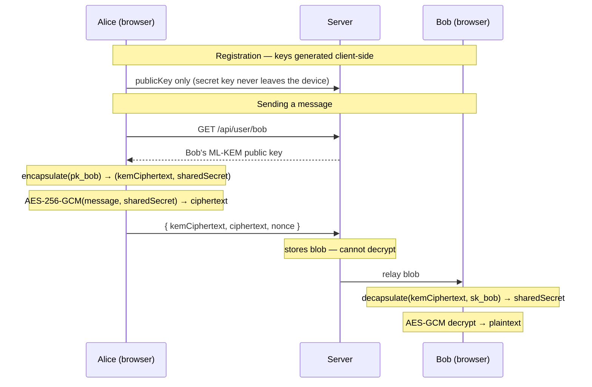

# 🔐 Quantum-Safe Chat

**End-to-end encrypted messaging that stays secure against quantum computers.**

A real-time chat application where messages are sealed in the browser using **ML-KEM-768** (Kyber) — the NIST-standardised post-quantum key encapsulation mechanism — and **AES-256-GCM**. The server relays and stores ciphertext it can never read.

<p>
  
  
  
  
</p>

---

## Screenshots

### Every message, inspectable



Expanding *inspect ciphertext* on any message shows the real cryptographic material behind it — a 1 088-byte ML-KEM-768 encapsulation, the 12-byte AES-GCM nonce, and the exact payload the server stored. The plaintext `hi` exists only in the browser.

### The rest of the flow

| Sign in | Keypair generation |
|---|---|
|  |  |
| Post-quantum primitives declared up front | Real ML-KEM-768 sizes, read live from the WASM module |

| Unlocking with your secret key | Live encrypted chat |
|---|---|
|  |  |
| The key is held in memory only, never transmitted | Presence, timestamps, and per-message inspection |

---

## Why post-quantum?

Today's key exchange (RSA, ECDH) is broken by Shor's algorithm on a sufficiently large quantum computer. The practical threat isn't the future — it's **"harvest now, decrypt later"**: an adversary records encrypted traffic today and decrypts it once quantum hardware matures.

Messages with a long confidentiality lifetime need quantum-resistant key exchange *now*. This project implements that end to end, in the browser.

**ML-KEM** (formerly CRYSTALS-Kyber) was standardised by NIST as **FIPS 203** in August 2024. Its security rests on the Module Learning With Errors problem, which has no known efficient quantum attack.

---

## How it works

Every message performs a fresh key encapsulation. There is no long-lived shared session key.



### The hybrid construction

| Layer | Algorithm | Purpose |
|---|---|---|
| Key encapsulation | ML-KEM-768 | Quantum-resistant transport of a 32-byte shared secret |
| Symmetric cipher | AES-256-GCM | Encrypts the message body; provides integrity via the GCM tag |

ML-KEM produces a shared secret, not a cipher — so a KEM/DEM construction is used: the KEM ships the key, AES-GCM does the bulk encryption.

### ML-KEM-768 parameters

| Value | Size | Where it lives |
|---|---|---|
| Public key | 1 184 B | MongoDB (public) |
| Secret key | 2 400 B | User's device only — downloaded as `<user>_SECRET.txt` |
| KEM ciphertext | 1 088 B | Stored per message |
| Shared secret | 32 B | Ephemeral, in memory only |

NIST security level 3 (≈ AES-192 equivalent).

---

## Security model

**What the server can see:** usernames, public keys, bcrypt password hashes, who messaged whom, timestamps, and ciphertext blobs.

**What the server can never see:** message content. It holds no secret key, and secret keys are never transmitted.

Each message is sealed **twice** — once to the recipient's public key and once to the sender's own — so the sender can still read their own history without the server ever holding a readable copy.

### Verified properties

Confirmed by inspecting the database directly after sending:

```
contains "Hello Bob":    false
contains "post-quantum": false
plaintext field present: false
```

### Session security

Authentication is a signed **JWT (HS256) in an HttpOnly, SameSite=Strict cookie**, expiring after 8 hours. Page scripts cannot read it, so an XSS bug cannot exfiltrate the session.

Critically, **the sender of a message is taken from the token, never from the request body.** Socket.io connections are rejected at handshake without a valid cookie, and `send_message` ignores any client-supplied `sender` field:

```js
const doc = await Message.create({
  sender: me,   // authenticated identity, not a client-supplied field
  receiver,
  ...
});
```

A client that connects as `alice` and emits `{ sender: 'bob', ... }` has the message stored as **alice** — verified in the test suite and by hand.

### Hardening

| Control | Where |
|---|---|
| Rate limiting | 10 logins / 15 min, 5 registrations / hour per IP; 60 messages / min per account |
| Input validation | Username charset and length, password length, exact ML-KEM-768 key and ciphertext sizes, 12-byte nonce, payload ceiling — all before any DB write or crypto call |
| Authorization | Public keys require a session; `/api/messages` returns **403** unless you are a participant in that conversation |

### Honest limitations

This is a university/portfolio project, not a production messenger. Known gaps:

- **No public-key verification.** The server hands out public keys to signed-in users, so a malicious *server* could still substitute its own and MITM the exchange. Real systems need key fingerprints or a transparency log.
- **No message signing.** Messages are confidential and tamper-evident (AES-GCM), and the sender is authenticated by session — but there is no cryptographic proof of authorship that survives outside the session. **ML-DSA** (FIPS 204) would provide it.
- **No forward secrecy.** Keypairs are long-lived; a stolen secret key decrypts all past messages. Each message does use a fresh encapsulation, so compromising one shared secret does not expose the others.
- **Requires TLS in production.** Passwords are sent to the server for bcrypt comparison, and the cookie only sets `Secure` when `NODE_ENV=production`.
- **Rate limiting is per-process.** A multi-instance deployment would need a shared store (Redis).
- **Metadata is not protected.** The social graph and timing are visible to the server.

---

## Tech stack

- **Next.js 14** (pages router) — UI and API routes
- **Socket.io** — real-time bidirectional relay
- **MongoDB + Mongoose** — persistence of users and ciphertext
- **liboqs** (Open Quantum Safe) compiled to **WebAssembly** via Emscripten
- **Web Crypto API** — AES-256-GCM, native in the browser
- **bcryptjs** — password hashing
- **jsonwebtoken** — signed session cookies
- **Vitest** — unit tests

## Tests

```bash
npm test
```

54 tests across 5 files, covering the security-critical paths:

| File | Covers |
|---|---|
| `crypto.test.js` | AES-256-GCM round-trip, unicode, nonce uniqueness, wrong-key rejection, **tampered-ciphertext rejection** (GCM integrity), swapped nonce |
| `auth.test.js` | JWT round-trip, tampered/expired/foreign-secret tokens, **`alg: none` rejection**, cookie flags, `requireAuth` 401 |
| `validate.test.js` | Username charset, password length, ML-KEM-768 key sizing (rejects Kyber-512 and ML-KEM-1024 sizes), blob shape |
| `rateLimit.test.js` | Limit enforcement, sliding window, per-key isolation, 429 + `Retry-After` |
| `encoding.test.js` | Base64 round-trip across every padding case, byte-length accounting |

The ML-KEM half of `lib/crypto.js` needs the browser WASM module, so it is exercised in-browser rather than in unit tests; the AES layer runs against Node's Web Crypto.

---

## Quick start

**Prerequisites:** Node.js 18+, MongoDB (local or Atlas), a WebAssembly-capable browser.

```bash
# 1) Configure environment
cp .env.local.example .env.local
#    MONGODB_URI=mongodb://127.0.0.1:27017/pqchat
#    JWT_SECRET=<32+ random characters>   generate one with:
node -e "console.log(require('crypto').randomBytes(48).toString('base64url'))"

# 2) Install and run
npm install
npm run dev

# 3) Run the tests
npm test
```

Open <http://localhost:3000>.

> **Testing two users:** open one normal window and one **incognito** window. The signed-in username is kept in `localStorage`, which is shared between tabs of the same browser profile — two tabs cannot hold two different users.

### Try it

1. **Register** — the browser generates an ML-KEM-768 keypair and downloads `<username>_SECRET.txt`. Only the public key is uploaded.
2. **Sign in**, then **unlock** by pasting or loading that secret key. It stays in memory and is never transmitted.
3. **Chat** — enter the other username and send. Hit *inspect ciphertext* under any message to see the actual KEM ciphertext, nonce, and stored payload.

> Running MongoDB locally? Inspect what the server actually stored:
> ```bash
> mongosh mongodb://127.0.0.1:27017/pqchat --eval "db.messages.findOne()"
> ```

---

## Project structure

```
├── lib/
│   ├── crypto.js          # WASM bridge: keygen, encapsulate, decapsulate, AES-GCM
│   ├── encoding.js        # base64 helpers shared by browser, server and tests
│   ├── auth.js            # JWT signing/verification + HttpOnly cookie handling
│   ├── validate.js        # input validation, ML-KEM-768 size constants
│   ├── rateLimit.js       # sliding-window limiter
│   └── db.js              # Cached Mongoose connection
├── models/
│   ├── User.js            # username, bcrypt hash, ML-KEM public key
│   └── Message.js         # ciphertext for recipient + sender copy
├── pages/
│   ├── api/
│   │   ├── register.js    # validates + stores public key
│   │   ├── login.js       # bcrypt verification, issues session cookie
│   │   ├── logout.js      # clears the session cookie
│   │   ├── me.js          # current identity from the signed cookie
│   │   ├── messages.js    # encrypted history, participants only
│   │   ├── socketio.js    # authenticated Socket.io relay + presence
│   │   └── user/[username].js
│   ├── index.js           # sign in
│   ├── register.js        # keypair generation
│   └── chat.js            # unlock, history decryption, live chat
├── tests/                 # Vitest suite
├── public/
│   ├── liboqs.js          # Emscripten loader
│   └── liboqs.wasm        # compiled liboqs
├── styles/globals.css
└── wrapper.c              # C shim exposing liboqs to WASM
```

### A note on `lib/crypto.js`

The WASM module is built with `-s ENVIRONMENT=web` and does not always expose `HEAPU8`. The bridge therefore reads and writes WASM memory through a fast path (direct heap access) with a fallback to Emscripten's `getValue`/`setValue`, so it works across build configurations.

---

## Rebuilding the WASM module

`public/liboqs.js` and `liboqs.wasm` are committed, so this is only needed to regenerate them.

**1. Install the toolchain**

```bash
brew install cmake ninja
git clone https://github.com/emscripten-core/emsdk.git
cd emsdk && ./emsdk install latest && ./emsdk activate latest
source ./emsdk_env.sh
```

**2. Build liboqs as a static library**

```bash
cd liboqs && mkdir build && cd build
emcmake cmake .. \
  -DOQS_BUILD_ONLY_LIB=ON \
  -DOQS_ENABLE_KEM_ML_KEM_768=ON \
  -DOQS_ENABLE_SIG_ML_DSA_65=OFF \
  -DBUILD_SHARED_LIBS=OFF \
  -DOQS_USE_OPENSSL=OFF \
  -DCMAKE_INSTALL_PREFIX=$(pwd)/../install \
  -DOQS_MINIMAL_BUILD="ML-KEM-768"
emmake make -j4 && emmake make install
```

**3. Link into `.js` + `.wasm`**

```bash
emcc -O3 \
  -s WASM=1 -s MODULARIZE=1 -s EXPORT_NAME="liboqs" \
  -s ALLOW_MEMORY_GROWTH=1 -s ENVIRONMENT=web \
  -s EXPORTED_FUNCTIONS='["_malloc","_free"]' \
  -s EXPORTED_RUNTIME_METHODS='["ccall","cwrap"]' \
  -I liboqs/install/include \
  wrapper.c liboqs/install/lib/liboqs.a \
  -o liboqs.js
```

`wrapper.c` exposes `init_kem`, `generate_keypair`, `encap_secret`, `decap_secret`, the size getters, and `free_kem`.

---

## Development notes

- **Editing `pages/api/socketio.js` requires a full server restart.** The Socket.io instance is cached on the HTTP server (`if (!res.socket.server.io)`), so hot-reloaded handler code is ignored.
- The Socket.io client bundle is served at `/api/socketio/socket.io.js` once the API route has been hit at least once.

---

## Roadmap

- [x] Signed session tokens in HttpOnly cookies
- [x] Server-side sender authentication on socket events
- [x] Rate limiting and input validation
- [x] Unit test suite
- [ ] **ML-DSA-65** signatures for non-repudiable authorship
- [ ] Key fingerprint verification / trust-on-first-use
- [ ] Conversation list with unread counts
- [ ] Group chat via per-recipient encapsulation

---

## References

- [NIST FIPS 203 — Module-Lattice-Based Key-Encapsulation Mechanism](https://csrc.nist.gov/pubs/fips/203/final)
- [Open Quantum Safe — liboqs](https://openquantumsafe.org/)
